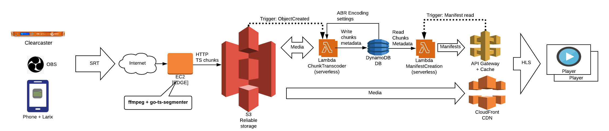
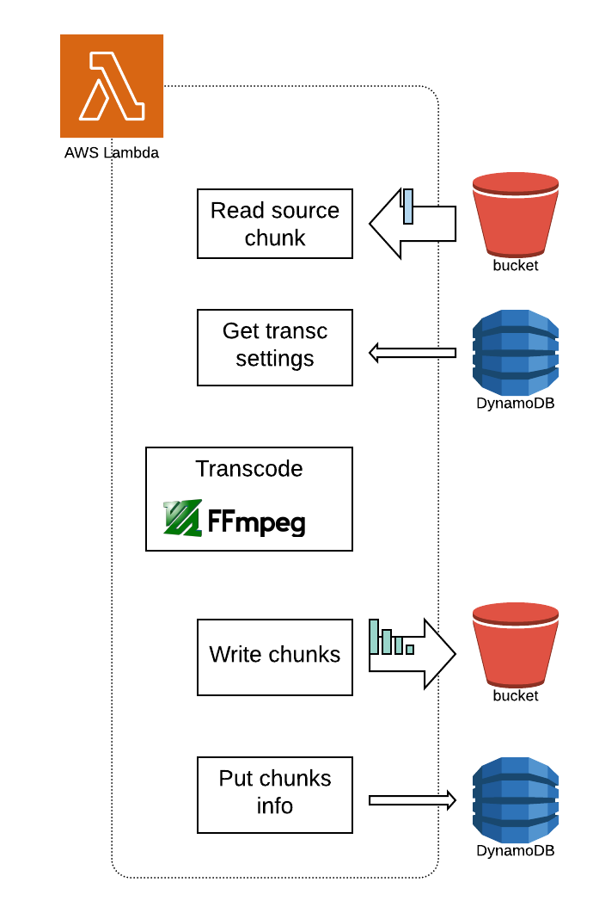

# Serverless distributed live platform

This system allows you to stream SRT (h264 + AAC) and create the live ABR in a fully distributed way. This implementation uses [AWS Lambdas](https://aws.amazon.com/lambda/) to perform a segmented serverless transcoding, this allow us to instantly scale to any type of renditions and transcoding settings, tested up to 2160p@60fps (h264 - AAC).

[](https://youtu.be/f7TkdI4f3jU)

This [player demo page](https://jordicenzano.github.io/serverless-distributed-live-platform/) allows you to simple create playback URLs for this platform, and also includes a player to facilitate testing (based on [VideoJS](https://videojs.com/))

**Disclaimer: This is just a proof of concept, it is not ready / designed to run in production environments**

## Introduction
In this section we will compare the common approach of "single host linear live transcoding" vs the one presented in this repo "distributed live transcoding"

### Single host linear live transcoding

Nowadays for livestreaming the most used architecture is to use single host to create [ABR ladder](https://en.wikipedia.org/wiki/Adaptive_bitrate_streaming) needed for distribution, see figure 2


*Figure 2: Single host linear live transcoding concept*

This is a simple and good approach, but it some problems: **scalability**, **flexibility**, **reliability**.

#### Scalability problem in linear transcoding 

When we ask the transcoding machine for more that it can handle, the machine starts transcoding **slower tan real time**, and this is a time bomb for live. The player will start stalling, and (depending on the implementation) that machine will OOM or drop data.
Log story short: Awful user experience

#### Flexibility problem in linear transcoding 

When the stream starts we can evaluate what are the best encoding params for each lane, but after this point it could be quite difficult to re-evaluate those encoding params.

Imagine the situation where we are resource constrained when the stream starts and we decide to apply fast encoding presets (so low quality) to save some CPU capacity, but few minutes after we have a lot of free resources, in this approach is quite difficult to update those encoding params

#### Reliability problem in linear transcoding 

We have one machine managing all the stream transcoding, if this **single** machine goes down, we lose the stream.
We can always mitigate that risk duplicating the transcoding stage, it can be done but it has some synchronization challenges

### Distributed live transcoding

In this approach the transcoding is performed in small temporal chunks.
The 1st step is to slice the continuos input stream in small (playable) chunks, then we can send those chunks to stateless transcoders, and finally those transcoders can generate the renditions for each individual chunk. See figure 3


*Figure 3: Distributed live transcoding concept*

#### Advantages of distributed live transcoding
- **Reliability**: If any transcoder machine goes down the stream will not be affected. That chunk is retry-able, or we could double transcode for important streams

- **Scalability**: You do not need to buy bigger machines to use more complex codecs / higher resolution - framerates, just use more of them (horizontal scaling for live transcoding)

- **Flexibility**: You can reevaluate your decisions every few seconds, so you can update (some) encoding settings at any time to meet any criteria

- **Deployability**: You can deploy any transcoding machine at any time without affecting the streams, this ability is "baked" into the architecture

#### Problems of distributed live transcoding
- **Decoder buffer size for VBV**: You will need to manage the decoder buffer size knowing that you will not have the data from previous chunk when you start the encoding
- **GOP Size**: The transcoding time will be proportional that, so if you are interested in providing some target latency you need to be able to control (limit) the input GOP size. Remember the shortest playable unit is a GOP. Also you need closed GOPs.
- **Audio priming**: In some audio codecs you need the last samples from previous chunk to be able to properly decode the current chunk audio, see this [post](https://developer.apple.com/library/archive/documentation/QuickTime/QTFF/QTFFAppenG/QTFFAppenG.html) for more info
- **Latency**: If you are planning to use encoders / resolution that your transcoding machines can NOT handle in real time (for instance AV1 4K), then you should expect an increased latency. But in this case I think is totally OK, because you can NOT do that in linear approach, now you can totally do it and the price to pay is "just" latency

## Distributed live streaming based on AWS lambdas
This is what we implemented in this repo


*Figure 4: Distributed live streaming based on AWS lambdas*

### Edge EC2 (ingest + slicer)

*Figure 5: Distributed live Edge EC2 contents*

- It terminates the [SRT protocol](https://github.com/Haivision/srt) and transmuxes the media to [Transport Stream (TS)](https://en.wikipedia.org/wiki/MPEG_transport_stream), all of these is done with a simple [ffmpeg](https://ffmpeg.org/) command

```bash
# Start RTMP listener / transmuxer to TS
ffmpeg -hide_banner -y \
-i "srt://0.0.0.0:1935?mode=listener" \
-c:v copy -c:a copy \
-f mpegts "tcp://localhost:2002"
```

- Uses this open source project [go-ts-segmenter](https://github.com/jordicenzano/go-ts-segmenter) to slice the input TS and upload the resulting chunks to [S3](https://aws.amazon.com/s3/). In these stage we also add the following info to each chunk in form of HTTP headers
  - Target suration in ms: `x-amz-meta-joc-hls-targetduration-ms`
  - Real duration in ms (for regular latency mode): `x-amz-meta-joc-hls-duration-ms`
  - Epoch time the chunk was created in the slicer in ns: `x-amz-meta-joc-hls-createdat-ns`
  - Sequence number of that chunk: `x-amz-meta-joc-hls-chunk-seq-number`

### Chunk transcoder lambda
Every time a chunk is uploaded from ingest to S3, the [joc-lambda-chunk-transcoder](./joc-lambda-chunk-transcoder/index.js) is automatically invoked.
This lambda contains an `ffmpeg` binary compiled to run inside of AWS Lambda environment

One of the advantages of using Lambdas is that they provide a deterministic execution framework, meaning if we have a problem transcoding chunk N, it is really easy to repro that problem, using the same code version, and input.


*Figure 5: Distributed live lambda transcoding*

This stateless function performs the following actions:
- Reads the current config for that stream from [DynamoDB](https://aws.amazon.com/dynamodb/), that includes the encoding params, see example of that config:
```json
{
  "config-name": "default",
  "desc": "4K (7 renditions)",
  "value": {
    "copyOriginalContentTypeToABRChunks": true,
    "copyOriginalMetadataToABRChunks": true,
    "mediaCdnPrefix": "https://MY-ID.cloudfront.net",
    "overlayEncodingData": true,
    "overlayMessage": "Test-",
    "publicReadToABRChunks": false,
    "renditions": [
      {
        "height": 2160,
        "ID": "2160p",
        "video_buffersize": 14000000,
        "video_crf": 23,
        "video_h264_bpyramid": "strict",
        "video_h264_preset": "slow",
        "video_h264_profile": "high",
        "video_maxrate": 7000000,
        "width": 3840
      },
      ...
      {
        "height": 144,
        "ID": "144p",
        "video_buffersize": 200000,
        "video_crf": 23,
        "video_h264_bpyramid": "strict",
        "video_h264_preset": "slow",
        "video_h264_profile": "high",
        "video_maxrate": 100000,
        "width": 256
      }
    ],
    "s3OutputPrefix": "output/",
    "video_pix_fmt": "yuv420p"
  }
}
```
- Applies that config and transcodes the input chunk (the one specified un the [S3 event](https://docs.aws.amazon.com/AmazonS3/latest/dev/notification-content-structure.html))

- It upload the resulting renditions S3, following the read config

- It updates the DynamoDB chunks table with the recently created chunks info, see entry example:
```json
{
  "duration-ms": 2002,
  "file-path": "20210101222117/144p/source_00131.ts",
  "first-audio-ts": -1,
  "first-video-ts": -1,
  "rendition-id": "144p",
  "s3bucket": "live-dist-test",
  "s3objkey": "output/20210101222117/144p/source_00131.ts",
  "seq-number": 131,
  "stream-id": "20210101222117",
  "target-duration-ms": 2000,
  "uid": "0ef4a832-5c83-4c70-bf92-bdcdf6305e4e",
  "wallclock-epoch-ns": 1609539942573507463
}
``` 

### Manifest generator lambda
To allow the playback of that live stream we implemented a "minimalist" manifest service inside a Lambda that creates an HLS manifest on the fly based on the info in DynamoDB.

This function is invoked when a players asks for a manifest, so when a player `GET` a URL like this:

```
https://CDN-PREPEND/video/streamId/manifest.m3u8?SEE-QS-POSSIBILITIES
```
OR
```
https://CDN-PREPEND/video/streamId/renditionID/chunklist.m3u8?SEE-QS-POSSIBILITIES
```

Valid querystring (QS) parameters are:
- `liveType`: Indicates what manifest we want (`live`, `event`, `vod`)
  - **This param allows you to create (chunk accurate) highlights before live ends (`vod`), or activate live rewind (`event`)**
- `chunksNumber`: Indicate how many chunks we want in the response
  - Only valid if `liveType == live`
- `latency`: Indicate how many seconds of latency you want to add.
  - This is recommended to be equal or bigger to the last possible transcoding time for your longer chunk
- `chunksLatency`: Indicate how many chunk of latency you want to add.
  - This is recommended to be equal or bigger to the last possible transcoding time for your longer chunk
  - If you set `latency` takes precedence over this
- `fromEpochS`: epoch time in seconds to start getting chunks
- `toEpochS`: epoch time in seconds to stop getting chunks
  - Only valid if `liveType == vod`
  - **Very useful to create VOD highlights from an ongoing live stream**, in combination with `fromEpochS`


*Figure 6: Distributed live lambda manifest*

- For the `manifest.m3u8` this Lambda
  - Gets stream config from DynamoDB and returns the chunklists copying the QS params
- For the `chunklist.m3u8`
  - Reads the `streamId`, `renditionId`, and QS params
  - Creates a query to DynamoDB
  - Generated a valid [HLS](https://tools.ietf.org/html/draft-pantos-http-live-streaming-23) manifest based in the query results
  - API Gateway caches that result (cache key included QS)

### CDN + API Gateway cache
To isolate our backend from the number of players we added a CDN that is used to serve the chunks.

#### Chunks
We added a Cloudfront file distribution with origin shield activated on top of the S3
- TTL: Could be very large, they are NOT mutable, and they are the same for VOD (highlights) and LIVE
- Cache key: It is the URL path

#### Manifests
We we also activated the cache on [API Gateway](https://aws.amazon.com/api-gateway/) to serve the manifests.
- TTL: We used short TTL because `chunklists.m3u8` is updated every `TARGET-DURATION`
- Cache key: It is the URL path AND the querystring parameters

### Some metrics

After proving the system works we gathered few basic metrics, for that we used 2 types of live streams:

- **HM**: High motion stream, it is a professionally produced sports VOD stream (that we transformed in a live stream using transmuxing and loop)
  - 2160p@59.94 20Mbps h264-AAC, 2s GOP
- **LM**: Low motion stream, generated from IPhone Xs with [Larix](https://softvelum.com/larix/) app
  - 2160p@30 12Mbps h264-AAC, 2s GOP
  - 1080p@30 12Mbps h264-AAC, 2s GOP

For the following test we have used:
- Lambda RAM: **10240MB (highest CPU)**
  - Cost per ms: $0.0000001667
- Segmenter chunk size: **2s**
- Encoding presets:
  - **SL7R**:
    - 7 renditions: 2160p, 1080p, 720p, 480p, 360p, 240p, 144p
    - h264 High, preset SLOW 
  - **VF7R**:
    - 7 renditions: 2160p, 1080p, 720p, 480p, 360p, 240p, 144p
    - h264 High, preset VERYFAST 
  - **SL6R**:
    - 6 renditions: 1080p, 720p, 480p, 360p, 240p, 144p
    - h264 High, preset SLOW 

In the following table you can see the avg and max transcoding Lambda execution time in ms.

*Remember Lambdas are billed by execution time, so we can easily calculate the CPU transcoding cost from those values and segmenter chunk size:
Number of lambdas invoked per hour = 3600/ChunkSize*

| Video    | Enc preset | Exec. time Avg (ms) | Exec. time Max (ms) | Transc. latency (s) | Transc. cost per 1h |
| -------- |:----------:| --------:|---------:| -------------------:|--------------------:|
| LM 1080p | SL6R       | 4000     | 5000     |               **5** |            **$1.2** |
| LM 4K    | SL7R       | 11000    | 14109    |              **15** |            **$3.3** |
| HM 4K    | VF7R       | 14741    | 19828    |              **20** |            **$4.4** |
| HM 4K    | SL7R       | 20000    | 32721    |              **33** |            **$6.0** |

Note: Cost calculated based on:
  - Lambda 10240MB (max CPU) and price at 2021/02/15 in VA: $0.0000001667/ms
  - 2s chunk size -> 1800 invokes/hour

#### Metrics takeaways
- **Transcoding latency (Content dependency)**: In linear transcoders we are used to have a deterministic latency, probably around 1 GOP. Now we are adding another variable that is the source content complexity, and that is usually out of our control.

- **Latency knob (Latency vs Quality)**: This system offers us the ability to reduce the induced transcoding latency decreasing the video quality (faster presets), and we can do that mid-stream

- **Cost knob (Cost vs Quality)**: The transcoding time is our cost, so that means if we want more quality we just need to apply slower presets, then latency will go up and our cost too. 
The same works the other way, if we want to pay less just apply faster preset, then cost, quality, and latency will go down.

*Note: For those takeaways we assumed the machine type (lambda type) is fixed, but in reality that is another know (machine size vs latency)*

# Learnings and Challenges
- Encoder rate - control
  - The next chunk N does NOT know about previous one (N-1), then we need to apply some constraints on the encoder rate - control algorithm to make sure the decoding buffer size is under control
- Variable scene complexity
  - Scenes with different complexity would need different encoding times, in this approach we need predictable (or limited) encoding time
- Variable input GOP size
  - Variable input GOP size is huge problem for this approach, since chunk transcoding times should be predictable (or limited) 
- Audio Priming
  - To properly decode audio, in some codecs we need samples from the previous chunks, see more info [here](https://developer.apple.com/library/archive/documentation/QuickTime/QTFF/QTFFAppenG/QTFFAppenG.html)

# Set up the environment
This part will help you to set up your AWS account to test this code.
We are assuming you have [AWS CLI](https://aws.amazon.com/cli/) installed and configured properly in your system

- [Set up edge machine](./docs/setup-edge.md)
- [Set up S3 bucket](./docs/setup-s3.md)
- [Give EC2 RW permissions to your S3](./docs/grant-s3-full-access-to-ec2.md)
- [Set up dynamoDB](./docs/../scripts/create-ddb.sh)
- [Set up Lambdas(create execution roles, lambdas, and upload code)](./docs/setup-lambdas.md)

//TODO
- [Set up transcode lambda trigger]()
- [Set up API Gateway (and manifest lambda trigger)]()
- [Set up CloudFront]()

# Test
This video will show you how to do some initial tests

[](https://www.youtube.com/watch?v=ESMNOfE2aZY)
TODO: Record the video

# TODOs
- Create a cloudformation template for AWS infrastructure. Or create a simple AWS CLI script